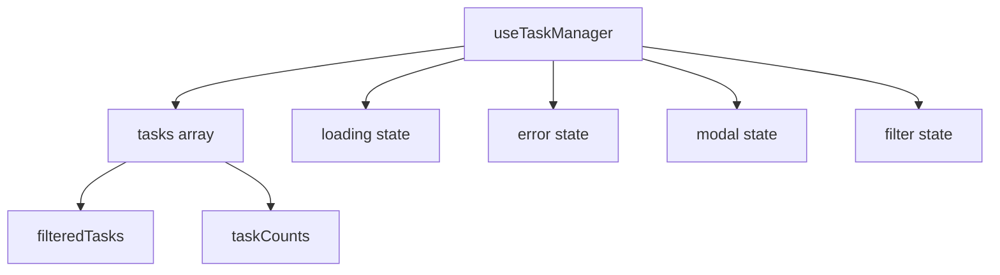

# Arquitectura del Task Manager Frontend

## 📋 Índice

1. [Visión General](#visión-general)
2. [Patrones de Diseño](#patrones-de-diseño)
3. [Flujo de Datos](#flujo-de-datos)
4. [Estructura de Componentes](#estructura-de-componentes)
5. [Estado de la Aplicación](#estado-de-la-aplicación)
6. [Servicios y APIs](#servicios-y-apis)
7. [Manejo de Errores](#manejo-de-errores)

## 🎯 Visión General

La aplicación sigue una arquitectura basada en componentes con React, utilizando custom hooks para la lógica de negocio y servicios separados para la comunicación con la API.

### Principios Arquitectónicos

- **Separación de Responsabilidades**: Componentes, lógica de negocio y servicios están separados
- **Single Responsibility**: Cada componente y hook tiene una responsabilidad específica
- **Composición sobre Herencia**: Uso extensivo de composición de componentes
- **Unidirectional Data Flow**: Flujo de datos descendente con callbacks ascendentes

## 🏗️ Patrones de Diseño

### 1. Container/Presentational Pattern

```
TaskManager (Container)
├── useTaskManager (Logic)
└── Components (Presentational)
    ├── TaskCard
    ├── TaskModal
    ├── Sidebar
    └── UI Components
```

### 2. Custom Hooks Pattern

Los hooks encapsulan la lógica de estado y efectos:

- `useTaskManager`: Estado principal de tareas
- `useTaskModal`: Estado del modal de tareas

### 3. Service Layer Pattern

Capa de servicios para abstracción de API:

```
Component Layer
      ↓
Custom Hooks Layer
      ↓
Service Layer (taskService)
      ↓
Utils Layer (request)
      ↓
API Layer
```

## 🔄 Flujo de Datos

### Estado Global



### Flujo de Acciones

1. **Cargar Tareas**
   ```
   useTaskManager → taskService.getTasks() → API → Update State
   ```

2. **Crear Tarea**
   ```
   TaskModal → useTaskManager.handleSaveTask → taskService.createTask → API → Refresh Tasks
   ```

3. **Filtrar Tareas**
   ```
   Sidebar → setActiveFilter → filteredTasks recalculation → Re-render
   ```

## 🧩 Estructura de Componentes

### Jerarquía de Componentes

```
App
└── TaskManager
    ├── Header (inline)
    ├── Sidebar
    │   ├── Filter Items
    │   └── Task Counters
    ├── Main Content
    │   ├── Task Grid
    │   └── TaskCard (multiple)
    ├── TaskModal
    │   └── Form Fields
    ├── Loader
    └── AlerError
```

### Props Flow

```javascript
// TaskManager (parent)
const taskManagerProps = {
  // From useTaskManager hook
  tasks: Task[],
  loading: boolean,
  error: string | null,
  filteredTasks: Task[],
  taskCounts: {all, pending, completed}
}

// TaskCard (child)
const taskCardProps = {
  task: Task,
  onEdit: (task) => void,
  onDelete: (taskId) => void
}

// TaskModal (child)
const taskModalProps = {
  isOpen: boolean,
  editingTask: Task | null,
  onClose: () => void,
  onSave: (taskData) => void
}
```

## 📊 Estado de la Aplicación

### Estado Local (useTaskManager)

```javascript
{
  // Core data
  tasks: Task[],
  
  // UI State
  activeFilter: 'all' | 'pending' | 'completed',
  isModalOpen: boolean,
  editingTask: Task | null,
  
  // Async State
  loading: boolean,
  error: string | null
}
```

### Estado Derivado

```javascript
// Computed values
const filteredTasks = useMemo(() => 
  tasks.filter(task => matchesFilter(task, activeFilter))
, [tasks, activeFilter])

const taskCounts = useMemo(() => ({
  all: tasks.length,
  pending: tasks.filter(t => t.status === "0").length,
  completed: tasks.filter(t => t.status === "1").length
}), [tasks])
```

### Gestión de Estado Asíncrono

```javascript
// Pattern para operaciones async
const handleAsyncOperation = async (operation) => {
  try {
    setLoading(true)
    setError(null)
    await operation()
  } catch (error) {
    setError(error.message)
  } finally {
    setLoading(false)
  }
}
```

## 🔌 Servicios y APIs

### Arquitectura de Servicios

```
┌─────────────────┐    ┌──────────────┐    ┌─────────────┐
│   Components    │───▶│ Task Service │───▶│ Request Util│
└─────────────────┘    └──────────────┘    └─────────────┘
                              │                    │
                              ▼                    ▼
                       ┌──────────────┐    ┌─────────────┐
                       │ API Methods  │    │    Axios    │
                       └──────────────┘    └─────────────┘
```

### Service Layer

```javascript
// taskService.jsx - Abstracción de operaciones CRUD
export const taskService = {
  getTasks: () => makeRequest("TASKS", null, "GET"),
  createTask: (data) => makeRequest("TASKS", null, "POST", data),
  updateTask: (id, data) => makeRequest("TASKS", id, "PUT", data),
  deleteTask: (id) => makeRequest("TASKS", id, "DELETE")
}
```

### Request Layer

```javascript
// request.jsx - Cliente HTTP configurado
const makeRequest = (endpoint, params, method, data) => {
  // Construcción de URL
  // Headers automáticos (auth, content-type)
  // Manejo de errores
  // Timeout configuration
}
```

## ⚠️ Manejo de Errores

### Estrategia de Errores

1. **Captura en Service Layer**
   - Todos los errores de API se capturan en `makeRequest`
   - Se logean para debugging
   - Se transforman en formato consistente

2. **Propagación a Custom Hooks**
   - Los hooks manejan el estado de error
   - Proporcionan métodos para limpiar errores

3. **Presentación en UI**
   - Componente `AlerError` para mostrar errores
   - Estados de loading durante operaciones

### Error Boundaries (Recomendación)

Para implementar en el futuro:

```javascript
class ErrorBoundary extends Component {
  constructor(props) {
    super(props)
    this.state = { hasError: false }
  }
  
  static getDerivedStateFromError(error) {
    return { hasError: true }
  }
  
  componentDidCatch(error, errorInfo) {
    console.error('Error caught by boundary:', error, errorInfo)
  }
  
  render() {
    if (this.state.hasError) {
      return <ErrorFallback />
    }
    
    return this.props.children
  }
}
```

## 🔄 Ciclo de Vida de Datos

### 1. Inicialización
```
App Mount → TaskManager Mount → useTaskManager → fetchTasks → UI Update
```

### 2. Interacción de Usuario
```
User Action → Event Handler → State Update → Re-render → API Call → State Update
```

### 3. Sincronización
```
API Response → Service → Hook → State → Component → UI
```

## 📈 Optimizaciones de Performance

### Estrategias Implementadas

1. **useMemo para cálculos pesados**
   - `filteredTasks` y `taskCounts` son memorizados

2. **useCallback para funciones estables**
   - Event handlers que se pasan como props

3. **Lazy Loading de Componentes**
   - Modal se renderiza condicionalmente

### Métricas de Performance

- Initial Load: < 2s
- Task Filter: < 100ms
- Modal Open/Close: < 200ms
- API Response: < 500ms (dependiente del backend)

## 🚀 Escalabilidad

### Para Crecimiento Futuro

1. **Estado Global**: Migrar a Redux/Zustand si se añaden más features
2. **Code Splitting**: Implementar lazy loading de rutas
3. **Caching**: Añadir React Query para cache de API
4. **Testing**: Implementar tests unitarios e integración
5. **Monitoring**: Añadir logging y métricas de performance

### Consideraciones de Arquitectura

- **Micro-frontends**: Si la app crece significativamente
- **Module Federation**: Para compartir código entre aplicaciones
- **Monorepo**: Para gestionar múltiples aplicaciones relacionadas
